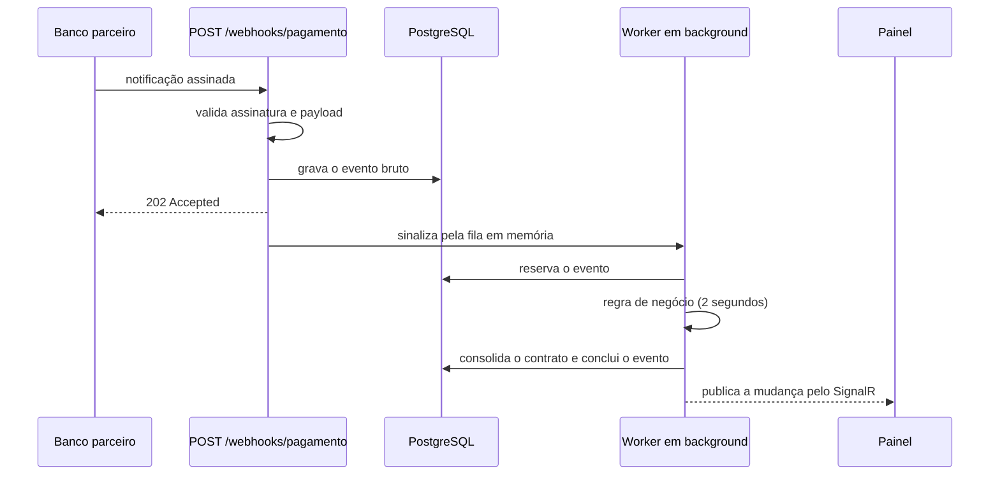

# Sabemi TEC: serviço de webhooks de pagamento

Serviço que recebe notificações de pagamento de um banco parceiro, garante que a mesma transação
nunca seja processada duas vezes, executa a regra de negócio em background e expõe um painel
administrativo que acompanha tudo em tempo real.

| Camada | Tecnologia |
| --- | --- |
| Backend | .NET 10, ASP.NET Core Minimal APIs, EF Core 10, SignalR |
| Banco | PostgreSQL 17 |
| Frontend | Next.js 16, React 19, TypeScript, Tailwind CSS 4, TanStack Query |
| Testes | xUnit, WebApplicationFactory, Testcontainers |
| Execução | Docker Compose |

## Como rodar

Pré-requisito: Docker.

```bash
cp .env.example .env
docker compose up --build
```

| Serviço | Endereço |
| --- | --- |
| Painel administrativo | http://localhost:3000 |
| API | http://localhost:8080 |
| Documentação da API | http://localhost:8080/scalar |
| Saúde da aplicação | http://localhost:8080/health/ready |

Com tudo no ar, dispare a sequência de demonstração e acompanhe o painel. Ela envia um pagamento
liquidado, um recusado pelo banco, um reenvio duplicado, um payload inválido e uma requisição com
assinatura forjada.

```bash
bash scripts/send-webhook.sh --demo      # Linux, macOS ou Git Bash
./scripts/send-webhook.ps1 -Demo         # Windows PowerShell
```

Os eventos aparecem na lista sem refresh, mudam de `Pendente` para `Liquidado` sozinhos e os que
falham ficam destacados com a mensagem que explica a recusa.

### Rodando fora do Docker

```bash
docker compose up -d db
dotnet run --project backend/src/Sabemi.Payments.Api   # http://localhost:8080
pnpm --dir frontend install && pnpm --dir frontend dev # http://localhost:3000
```

## O fluxo



O compromisso com o banco parceiro é responder rápido. Por isso o endpoint apenas autentica,
valida e persiste, enquanto o processamento pesado acontece fora do ciclo da requisição.

## Contrato do webhook

`POST /webhooks/pagamento`

```json
{
  "id_transacao": "TRX-8842",
  "id_contrato": "CT-1029",
  "valor": 1240.00,
  "data_pagamento": "2026-08-20T10:00:00-03:00",
  "status": "sucesso"
}
```

O campo `status` aceita `sucesso` ou `erro`. Um pagamento recusado é um evento processado com
sucesso do nosso lado, mas não entra no total liquidado do contrato.

### Autenticação

Cada requisição carrega dois headers:

| Header | Conteúdo |
| --- | --- |
| `X-Timestamp` | Momento do envio, em segundos desde a época Unix |
| `X-Signature` | `sha256=` seguido do HMAC-SHA256 de `{timestamp}.{corpo bruto}` em hexadecimal |

O segredo compartilhado fica em `WEBHOOK_SIGNING_SECRET`. A comparação usa
`CryptographicOperations.FixedTimeEquals`, e requisições com carimbo de tempo fora de uma janela
de cinco minutos são recusadas.

Assinar o carimbo junto com o corpo é o que impede que uma requisição capturada seja reenviada
depois com um carimbo novo.

### Respostas

| Situação | Status |
| --- | --- |
| Aceito para processamento | 202 |
| Reenvio do mesmo `id_transacao` | 200 com `duplicated: true` |
| Corpo não é um JSON válido | 400 |
| Assinatura ausente, inválida ou fora da janela | 401 |
| Tipo de conteúdo diferente de `application/json` | 415 |
| Corpo acima de 64 KB | 413 |
| JSON válido reprovado nas regras de negócio | 422, com o evento registrado para auditoria |
| Falha de infraestrutura | 500 |

Em webhook, 4xx significa "não reenvie" e 5xx significa "reenvie". Por isso a validação de negócio
nunca vira 500, e o único 5xx possível é falha real de infraestrutura.

## Modelo de dados

**`webhook_event_logs`** é o log de eventos brutos e, ao mesmo tempo, a fila durável do
processamento. Guarda o payload original em `jsonb`, o hash do corpo, a situação do processamento,
a mensagem de erro exibida no painel, o contador de tentativas e o momento da próxima tentativa.
O índice único em `transaction_id` é a fonte da verdade da idempotência.

**`contract_statuses`** é a situação consolidada de cada contrato: último resultado, última
transação, data do último pagamento, total liquidado e quantidade de pagamentos.

Valores monetários usam `decimal` no domínio e `numeric(18,2)` no banco. Datas são `timestamptz`
normalizadas para UTC na borda da aplicação.

## Decisões técnicas

**Idempotência no banco, não na aplicação.** Uma consulta prévia não resolve duas notificações
simultâneas. Quem garante a unicidade é o índice único em `transaction_id`, e a violação de chave
é traduzida em uma resposta 200 idempotente. Depois de uma violação o rastreador de mudanças do
EF fica inconsistente, então a leitura do registro existente usa um contexto novo.

**Idempotência de efeito, não só de registro.** Proteger apenas a inserção não basta: se a
consolidação do contrato acontecesse fora da transação que conclui o evento, uma nova tentativa
somaria o mesmo pagamento duas vezes. O upsert do contrato e a marcação do evento como processado
acontecem na mesma transação.

**Transactional inbox, não outbox.** A tabela de eventos brutos é a fila durável. O `Channel` em
memória é apenas um sinal para evitar latência de polling, e a entrega é garantida pelo banco: uma
varredura periódica reenfileira eventos pendentes, vencidos ou reservados por uma instância que
não concluiu o trabalho. Outbox existe para resolver escrita dupla entre banco e broker externo,
que não existe neste desenho. A evolução natural seria `LISTEN/NOTIFY` e, em escala maior, um
broker com consumidores concorrentes.

**Reserva com `FOR UPDATE SKIP LOCKED`.** O worker reserva o evento com uma instrução atômica, o
que mantém o processamento correto mesmo com várias instâncias da API rodando, sem nenhuma
infraestrutura adicional.

**Eventos fora de ordem.** O banco parceiro pode reenviar uma notificação antiga depois de uma
nova. No upsert do contrato os acumuladores somam sempre, mas os campos do último pagamento só são
sobrescritos quando o evento é mais recente, o que é resolvido em uma única instrução com `CASE`.

**Falha com estado terminal.** O backoff é exponencial (1s, 4s, 16s) e, esgotadas as tentativas, o
evento vai para `PermanentlyFailed`. Sem estado terminal, um evento envenenado giraria para
sempre. Esses eventos aparecem destacados no painel e podem ser reenfileirados manualmente por
`POST /api/payments/{id}/reprocess`.

**Evento inválido é registrado, não descartado.** O requisito pede alerta visual para falhas de
validação, e isso só é possível se o evento reprovado continuar visível. Ele é persistido com a
mensagem de erro, marcado como `Invalid`, e não toca na situação do contrato.

**Reenvio divergente é sinalizado.** Se o mesmo `id_transacao` chega com um corpo diferente, a
resposta continua idempotente, mas a divergência fica registrada e visível no painel. Isso indica
correção do lado do parceiro ou tentativa de fraude.

**Sem repositório genérico sobre o EF Core.** O `DbContext` já é unidade de trabalho e repositório.
Uma camada genérica em cima dele só adicionaria indireção.

## Estrutura

```
backend/
  src/Sabemi.Payments.Api/             endpoints, filtro de assinatura, hub SignalR
  src/Sabemi.Payments.Core/            domínio, contratos, validação e políticas
  src/Sabemi.Payments.Infrastructure/  EF Core, ingestão, processamento e consultas
  tests/                               suíte unitária e de integração
frontend/
  src/app/                             layout e página do painel
  src/components/                      primitivos de interface e componentes do painel
  src/hooks/                           consultas, tempo real e utilidades
  src/lib/                             cliente da API, formatação e provedores
docs/requests.http                     coleção de requisições
scripts/                               assinatura e envio de webhooks
```

O código é escrito em inglês. O contrato do webhook mantém os nomes em português exigidos pelo
enunciado, e a interface e as mensagens de validação também são em português, porque são lidas por
quem opera o painel.

## Testes

```bash
cd backend
dotnet test
```

A suíte de integração sobe um PostgreSQL descartável com Testcontainers, então o Docker precisa
estar rodando. São 70 testes, e a suíte inteira leva poucos segundos.

Os unitários cobrem a validação de assinatura, incluindo corpo adulterado, segredo trocado, janela
de replay e reaproveitamento de assinatura com outro carimbo; as regras de validação do payload,
mensagem por mensagem; a política de retry; e a tradução entre o ciclo de vida do evento e a visão
exibida no painel.

Os de integração exercitam a aplicação de verdade, de ponta a ponta: caminho feliz até a
consolidação do contrato, reenvio sequencial que não pode dobrar o total, dez notificações
simultâneas que precisam gerar um único registro, assinatura inválida que não persiste nada,
payload reprovado que fica visível sem tocar no contrato, recuperação de um evento pendente
inserido direto no banco, chegada fora de ordem, reprocessamento manual e os filtros da listagem.

## O painel

- Lista em tempo real por SignalR, com realce na linha que acabou de chegar ou mudar de estado.
- Filtro por situação (todos, sucesso, erro, pendentes) e busca por contrato, ambos refletidos na
  URL, então um recorte do painel é compartilhável.
- Alerta visual claro para eventos com falha, com a mensagem de validação na própria linha.
- Detalhe lateral com o payload original, a situação do contrato, a linha do tempo do
  processamento e a ação de reprocessar.
- Cartões de resumo com contadores animados e gráfico de fluxo dos últimos trinta minutos.
- Navegação por teclado, respeito a `prefers-reduced-motion` e layout responsivo.

Quando a conexão em tempo real cai e volta, a lista é buscada novamente, porque o que aconteceu
durante a queda não chegou por evento.

## O que ficou de fora

OpenTelemetry, broker externo, autenticação de usuários no painel, manifests de Kubernetes e
pipeline de integração contínua. São escolhas conscientes para manter o escopo no que o desafio
pede, com qualidade, em vez de espalhar superfície sem profundidade.
